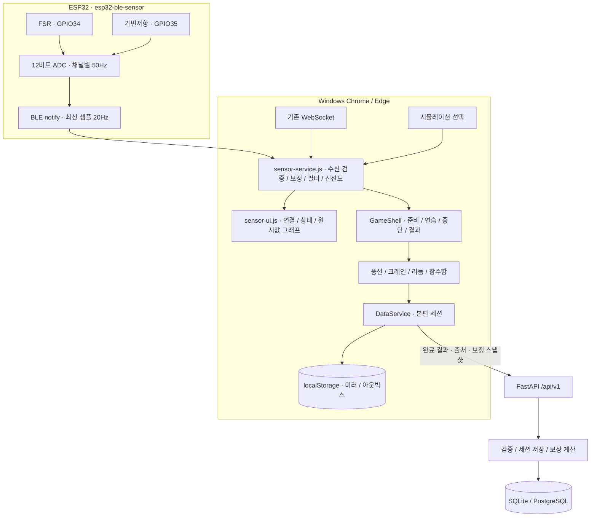

# ReGrip 아키텍처

**2026-09-05 코드 기준.** 현재 제품은 정적 HTML 13개와 공통 JavaScript, FastAPI API, SQLite 개발 DB로 구성됩니다. ESP32 BLE의 FSR 압력으로 게임을 조작하며, 가변저항으로 모사한 flex 값은 진단용으로만 표시합니다. 기존 제품 디자인을 유지하고 `design-review/` 목업은 제품과 분리합니다.

이 문서가 현재 구현의 기준입니다. 이전 설계 문서의 WebSocket 우선 전송, 12개 페이지, 향후 시계열·확장 계획은 현재 구현과 구분해서 읽습니다. 실행·테스트 증거는 [검증 기록](docs/VERIFICATION.md), 사용자 연결 절차는 [센서 가이드](docs/SENSOR_GUIDE.md)에 있습니다.

## 전체 흐름



센서의 실시간 입력은 브라우저 안에서 처리합니다. 게임 조작에 API 왕복이 필요하지 않습니다. 서버는 본편 완료 결과와 세트 상세를 저장하고 계정별 기록·보상을 관리합니다.

## 코드 구성

| 위치 | 역할 |
|---|---|
| 루트 HTML 13개 | `index`, `login`, `profile`, `settings`, `calibration`, `training`, 게임 4개, `history`, `achievements`, `level` |
| `sensor-service.js` | BLE·WebSocket·시뮬레이션의 입력 인터페이스, 보정, 필터, 재연결, 수신 상태 |
| `sensor-ui.js` | 설정·게임 준비 화면의 연결 UI와 FSR/flex 모사 원시값 그래프 |
| `shared.js` | DataService, GameShell, 난이도, 공통 UI·보상·기록 유틸리티 |
| `game-*.html` | DOM/SVG 렌더링과 게임별 판정·점수·세트 상세; rAF 루프 |
| `backend/src/api`, `schemas` | HTTP 경계, 인증·소유권·입력 검증 |
| `backend/src/services` | 세션 트랜잭션, 보상·업적 계산, 아바타 저장 |
| `backend/src/models`, `migrations` | ORM 모델과 PostgreSQL SQL 마이그레이션 |
| `firmware/esp32-ble-sensor` | 현재 BLE 2채널 원시 ADC 펌웨어 |
| `firmware/esp32-grip-sensor` | 기존 Wi-Fi WebSocket 펌웨어 |
| `backend/scripts/ml` | 제품과 연결되지 않은 오프라인 EMG 연구 |

프런트엔드는 빌드 없이 정적 서버로 실행합니다. Tailwind와 일부 폰트의 CDN 의존성이 있으므로 로컬 데이터 보존과 인터넷 차단 상태의 최초 화면 로드는 별개입니다.

## 센서 입력과 보정

BLE 패킷은 `timestamp_ms,flex_raw,fsr_raw`의 ASCII CSV입니다. ADC는 0~4095이고 장치 타임스탬프는 uint32 밀리초입니다. ESP32는 채널별 50Hz로 측정하고 최신 샘플을 BLE로 20Hz 전송합니다. USB 시리얼은 측정 확인용이며 브라우저 Web Serial 연결은 구현하지 않았습니다.

서비스는 형식·범위를 벗어난 패킷과 중복·역순 타임스탬프를 거부하고, uint32 롤오버는 허용합니다. 거부한 패킷으로 수신 신선도를 갱신하지 않습니다. 유효 패킷 수신 후 500ms가 지나면 `stale` 상태가 됩니다.

BLE 게임 입력은 FSR만 사용합니다. 보정 결과를 다음 식으로 0~100%로 변환한 뒤 시간 상수 80ms의 지수 필터를 적용합니다.

```text
normalized = clamp((fsr_raw - baseline0) / (baseline100 - baseline0) × 100, 0, 100)
filtered += (normalized - filtered) × (1 - exp(-deltaMs / 80))
```

`baseline0`은 손에 힘을 뺀 상태, `baseline100`은 편안하게 쥔 상태의 기준입니다. 압력 증가 시 ADC가 증가하거나 감소하는 회로를 모두 지원합니다. 이 값은 개인 보정 기준 대비 비율이며, 절대 힘 단위로 환산한 값은 아닙니다.

각 기준은 버튼을 누른 뒤 1초 동안 새로 수신한 FSR 표본의 중앙값입니다. 단계당 유효 표본 15개 이상, 수신 간격 150ms 이하를 요구합니다. 두 중앙값의 차이는 절댓값 64 ADC 이상이고, 각 단계의 P95-P5 폭은 기준 차이의 20% 이하여야 합니다. 연결·사용자·기기가 바뀌거나 수신이 중단되면 캡처를 취소합니다. 로컬 저장에 실패하면 보정 완료로 처리하지 않습니다.

보정은 브라우저 사용자와 BLE 기기 ID별로 저장합니다. 기존 `regrip_calibration`의 논리값 보정을 BLE 원시 ADC에 재사용하지 않습니다. 본편에 보관하는 스냅샷은 다음과 같습니다.

```json
{
  "version": 2,
  "source": "ble",
  "unit": "adc_12bit",
  "channel": "fsr",
  "baseline0": 700,
  "baseline100": 2100,
  "capturedAt": "2026-09-05T12:00:00Z"
}
```

### 연결과 게임 상태

첫 BLE 연결은 사용자의 연결 버튼에서 기기 선택창을 엽니다. 기존 권한 복원은 저장한 정확한 기기 ID만 사용합니다. 다른 동명 기기로 자동 대체하지 않습니다. 자동 재연결은 1·2·4·8초 간격으로 최대 4회 시도하고, 이후에는 수동 재연결을 기다립니다. 명시적 연결 해제는 자동 재연결을 중단합니다.

BLE 준비 완료는 최신 유효 패킷과 현재 사용자·기기 보정이 모두 있어야 합니다. WebSocket은 최신 수신이 필요하며 기존 보정 경로를 유지합니다. 시뮬레이션은 사용자가 선택하고, 센서 단절 시 자동으로 시뮬레이션으로 전환하지 않습니다.

GameShell은 본편 시작 때 입력 출처·보정 스냅샷을 복사해 고정하고 종료 결과에도 같은 값을 사용합니다. 진행 중 모드나 보정이 달라지면 이어서 혼합 기록하지 않습니다. `stale`, 연결 해제, 탭 숨김 뒤에는 일시정지하고 준비가 회복되어야 사용자가 직접 재개할 수 있습니다.

## 게임과 시간 계산

저장된 난이도가 없으면 `easy`, 이전 `normal`은 `medium`으로 해석합니다. 기존 별점·XP 기준은 유지하고, 초보자 입력 허용 범위와 실제 판정을 연결했습니다.

| 게임 | 본편 | 주요 판정 | 연습 완료 조건 |
|---|---|---|---|
| 풍선 | 120초 | 목표 높이와 목표 압력 범위를 함께 만족하면 정지·유지, 3초 유지로 점수 | 풍선 1개 |
| 크레인 | 60초 | 잡기·들기·운반·놓기 단계; 놓기 기준 미만으로 힘을 풀어야 성공 | 놓기 1회 |
| 리듬 | 8회 × 3세트 | 박자 허용 구간에서 쥐기 임계값 통과, 힘을 풀고 다음 박자 진행 | 판정 4회 |
| 잠수함 | 90초 · 관문 30개 | 필터된 동일 압력값으로 위치 표시와 관문 판정 | 관문 판정 3회 |

풍선은 목표 압력 60%, 난이도별 폭 28·20·12%p를 사용합니다. 쉬움은 46~74%입니다. 높이 이동은 `clamp((force - 60) × 0.6, -12, 12)`%/초이며 목표 높이와 압력 범위 안에서는 멈춥니다. 범위를 벗어나면 유지 시간이 초당 0.5초 감소합니다.

프로필 목표 압력의 기본값 80%에서 크레인 쉬움 기준은 잡기 60%, 유지 최소 50%, 운반 최소 38%, 놓기 30% 미만입니다. 목표 압력을 바꾸면 파생 기준도 달라집니다. 힘 부족의 500ms 유예 중 유지 시간을 쌓지 않습니다. 운반 상태로 제한 시간이 끝나도 성공 점수를 주지 않습니다.

리듬의 박자 판정과 별점 기준은 유지합니다. 일시정지 직전 성립한 쥐기는 세트 상세에 반영하고 입력 상태를 초기화해 재개 시 누락을 막습니다. 잠수함은 표시와 판정 사이에 서로 다른 추가 필터를 두지 않습니다.

공통 시간 규칙은 다음과 같습니다.

- 정상 프레임에서는 실제 경과 시간을 움직임·유지 시간·게임 시간에 동일하게 반영합니다. 낮은 FPS라고 유지 판정만 느려지지 않습니다.
- 단일 프레임 공백이 **250ms를 초과하면** 게임을 일시정지하고 그 공백을 점수·유지 시간에 소급 반영하지 않습니다.
- 사용자 일시정지·숨김·센서 중단 시간은 훈련 시간에서 제외합니다. 리듬의 예정된 세트 간 휴식은 본편 진행 시간에 포함합니다.
- 포인터가 버튼 밖에서 놓이거나 취소되고, 키가 해제되거나 창 포커스를 잃는 경우 입력을 해제합니다.
- 연습은 목표 달성 또는 최대 20초에서 종료하고 세션·XP를 저장하지 않습니다. 연습 반복과 본편 시작은 상태를 초기화합니다.

## 기록, 출처와 통계

| 필드·필터 | 의미 |
|---|---|
| `inputSource: ble` | BLE를 선택한 본편; 보정 스냅샷 필수 |
| `inputSource: websocket` | 기존 WebSocket을 선택한 본편 |
| `inputSource: simulation` | 시뮬레이션 본편 |
| `inputSource: unknown` | 이전 기록 또는 출처를 알 수 없는 기록 |
| `source=real` | BLE와 WebSocket 세션의 측정 통계 |
| `source=all`, `simulation`, `unknown` | 전체 또는 해당 출처별 목록·측정 통계 |

과거 기록에 센서 출처를 추정해서 붙이지 않습니다. BLE 외 출처는 BLE 보정 스냅샷을 제출할 수 없습니다. 브라우저의 BLE 기기 ID를 서버 `devices.id` UUID로 대신 사용하지 않습니다.

홈의 측정 요약은 실제 센서 세션을 기준으로 계산하고, 기록 화면은 출처별 목록과 통계를 함께 필터링합니다. XP·레벨·연속 훈련은 필터에 관계없이 모든 본편 기록을 기준으로 유지합니다. `real`은 입력 경로 분류이며 서버가 물리 센서의 진위를 증명했다는 뜻은 아닙니다.

### 로컬 보존과 서버 동기화

1. 본편 결과를 로컬 세션 미러에 저장합니다.
2. 고정된 `clientSessionId`와 출처·보정 스냅샷을 포함한 API 페이로드를 만듭니다.
3. **네트워크 요청 전에** 해당 페이로드를 아웃박스에 저장합니다.
4. 전송 성공 시 같은 ID의 대기 항목을 제거하고 서버 결과를 반영합니다. 통신 실패 시 재시도할 항목을 남깁니다.
5. 서버는 `(user_id, client_session_id)` 유일성으로 재전송을 멱등 처리하여 최초 결과를 돌려주고 XP를 중복 적립하지 않습니다.

서버는 세션·세트 저장, 별점·XP·streak·업적 갱신을 트랜잭션에서 처리합니다. 클라이언트가 제시한 별점·XP를 그대로 신뢰하지 않지만, 제출한 게임 점수와 압력 요약 자체에 대한 센서 인증은 구현하지 않았습니다.

## 백엔드와 DB 변경

API 경계는 힘 비율의 유한값·0~100 범위, 점수·시도 수 범위, 중복 세트 인덱스, UUID, 입력 출처와 스냅샷 조합 등을 검증하고 잘못된 입력은 422로 반환합니다. 설정 시간대는 유효한 IANA 식별자여야 합니다. 보정 API에 `deviceId`를 제출하면 등록된 기기의 현재 사용자 소유권을 확인합니다. 기기 등록 API는 아직 구현하지 않았습니다.

정적 파일 공개 범위는 `/static/avatars`의 아바타 디렉터리이며 DB·백업을 포함한 전체 저장소를 공개하지 않습니다.

PostgreSQL은 `001_init` → `002_game_types` → `003_signal_catalog` → `004_session_provenance` 순서입니다. 002는 이전 CHECK를 제거한 뒤 `normal`을 `medium`으로 바꾸고 새 제약을 추가합니다. 004는 `input_source`와 `calibration_snapshot`을 추가하며 기존 기록은 `unknown`으로 유지합니다.

새 SQLite DB는 앱 시작 시 생성합니다. 기존 DB는 `create_all`로 컬럼을 갱신하지 않으므로, API를 중지한 뒤 `backend/scripts/upgrade_sqlite.py`를 사용합니다. 도구는 기존 ReGrip DB 경로·무결성을 확인하고 SQLite backup API로 백업한 다음, 트랜잭션에서 누락된 004 컬럼만 추가합니다. 재실행은 변경 없이 종료하며 기존 점수·XP·기록을 삭제하거나 재계산하지 않습니다.

2026-09-05에는 기존 개발 DB의 실제 업그레이드와 두 번째 dry-run의 변경 없음 결과를 확인했습니다. 백업은 `backend/.backups/regrip_dev.db.pre-004.20260905T123028898409Z.bak`입니다. PostgreSQL 마이그레이션의 실제 DB 실행은 이번에 확인하지 않았습니다.

## 구현과 검증의 경계

BLE 펌웨어는 PlatformIO 빌드에 성공했고 RAM 12.0%, Flash 86.4%를 사용했습니다. 실제 보드 업로드·통신 검증은 하지 않았습니다. 코드 테스트와 로컬 서버 HTTP 확인은 실제 브라우저 조작·화면 검수와 구분합니다. 최종 테스트 수와 명령 결과는 [VERIFICATION.md](docs/VERIFICATION.md)에만 기록합니다.

API·모델에는 `forceSeries` 필드가 있지만 현재 게임 프런트엔드는 1Hz 시계열을 생성·업로드하지 않습니다. 원시 파형 업로드, 별도 시계열 저장소, 기기 인증, 제품 내 ML 추론은 현재 구현에 포함되지 않습니다. NinaPro DB2 기반 EMG 실험은 별도 오프라인 연구이며 FSR 또는 가변저항 모사값의 실시간 분류 경로가 아닙니다. 과거 Stage 3 확장안은 [센서 데이터 정책](docs/backend/04-sensor-data-policy.md)과 [확장 로드맵](docs/backend/05-scaling-roadmap.md)의 계획으로 구분합니다.

## 저장 소유권 경계

REST 미러·아웃박스·프로필·설정·기존 Wi-Fi 보정은 API 주소와 사용자 ID별 키로 분리한다. 세션 저장과 비동기 조회는 요청 시점의 소유자를 고정하며, A 계정의 지연 응답이나 재전송이 B 계정에 반영되지 않는다. 게임 시작 후 계정·서버가 바뀌면 이전 게임 결과를 새 소유자로 저장할 수 없다.

이전 소유권 정보가 없는 키는 삭제하지 않고 보존하며 새 계정으로 자동 귀속하지 않는다. 로컬 기록 업로드는 기존의 명시적 선택 절차를 사용한다. BLE 보정은 API·사용자·장치별로 저장한다. 같은 문서 안에서 계정이나 API가 바뀌면 센서 입력을 차단하고 새로고침을 안내한다.
