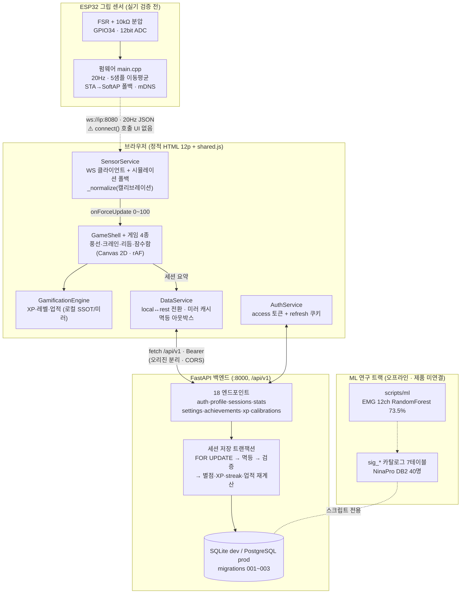
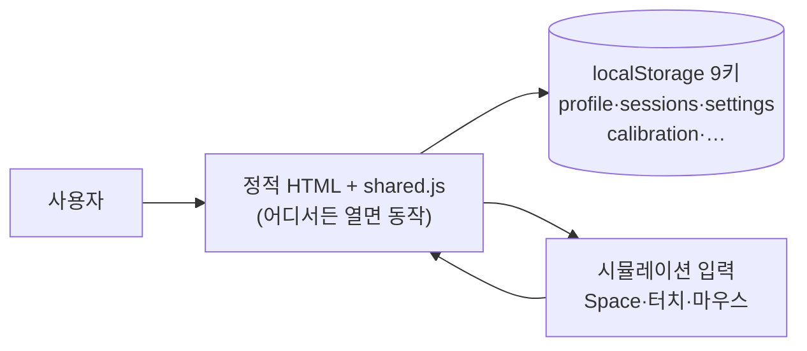
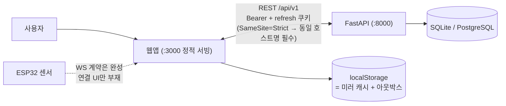
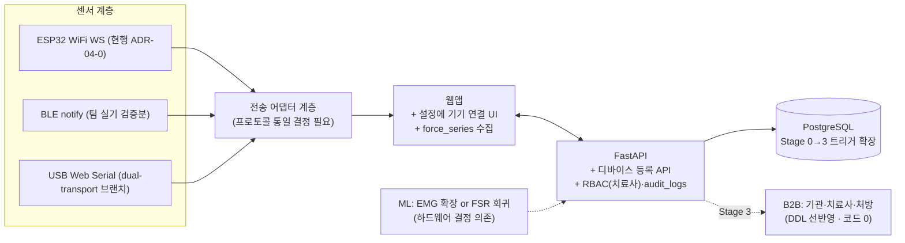
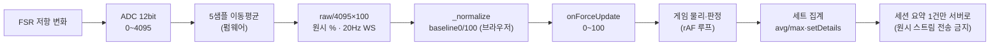
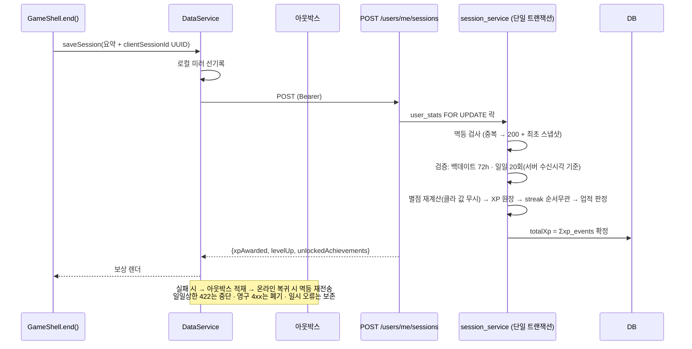
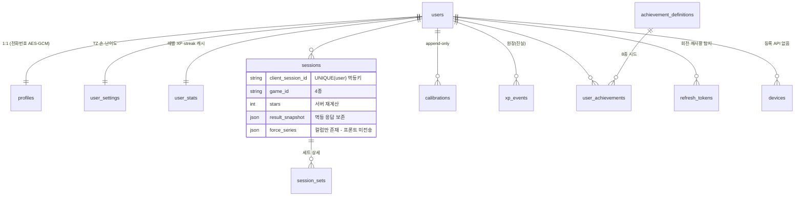

# ReGrip 아키텍처 (2026-08-01, 실코드 기준 전면 재작성)

> 이 문서는 main(2d4a7cc) 기준으로 펌웨어·웹앱·백엔드·ML 트랙 실코드를 정독해 작성한 사실 기반 SSOT다.
> 이전 판(2026-06-06, 백엔드 부재·2게임 시절)은 폐기했다. 세부 근거는 `docs/backend/00~09`, 센서 정책은 ADR-04-*.

---

## 1. 개요

ReGrip은 손 재활 환자를 위한 게이미피케이션 훈련 제품이다. 세 층으로 구성된다:

1. **펌웨어** (`firmware/esp32-grip-sensor`) — ESP32 + FSR(악력 센서). WiFi WebSocket(:8080)으로 `{"force":0~100,"timestamp":millis}`를 20Hz 브로드캐스트. 캘리브레이션은 하지 않는다(웹앱 몫).
2. **웹앱** (루트 정적 HTML 12페이지 + `shared.js` 2,565줄) — 빌드 도구 없는 바닐라 JS. 서비스 계층(Auth/Data/Sensor/Gamification/GameShell)이 전부 shared.js에 있다. 게임 4종(풍선·크레인·리듬·잠수함)은 Canvas 2D + rAF.
3. **백엔드** (`backend/`, FastAPI :8000) — `/api/v1` 18개 엔드포인트, JWT(access 30분) + httpOnly refresh 쿠키(14일 회전·재사용 탐지), SQLite(dev)↔PostgreSQL(prod) 단일 전환.

별도로 **ML 연구 트랙**(NinaPro DB2 EMG 12ch 제스처 분류, RandomForest 평균 73.5%)이 백엔드에 동거하지만 오프라인 스크립트 전용 — 제품 루프와 미연결(§6).

### 설계 원칙 (실코드로 확인된 것)

- **서버가 진실을 계산한다.** 클라이언트가 보낸 별점은 무시하고 서버가 재계산, `totalXp = Σxp_events` 원장 불변식, `UNIQUE(user_id, clientSessionId)` 멱등키 (`session_service.py:85`).
- **센서 실시간 데이터는 로컬 처리** (ADR-04-1). 원시 스트림은 서버로 절대 안 보냄 — 세션 요약 1건만 제출. 캘리브레이션 정규화도 브라우저에서.
- **로컬↔REST 완전 패리티.** 서버 없이도 전 기능 동작(localStorage), 로그인하면 같은 코드가 REST로 전환되고 localStorage는 미러+오프라인 아웃박스가 된다.
- **과설계 금지** (docs/backend/05): MSA·Kafka·K8s·GraphQL 명시적 금지, 트리거 기반 Stage 0~3 (PostgreSQL→Redis→읽기복제본→TimescaleDB).

---

## 2. 시스템 전체 구성도 (현재 main)

**흐름.** 게임은 `SensorService.onForceUpdate`로 정규화된 0~100 악력을 받는다 — 실센서가 없으면 시뮬레이션(Space/터치, +55%/s·−45%/s)이 기본. 게임 종료 시 `GameShell.end()`가 세션 요약을 `DataService.saveSession`으로 보내고, REST 모드면 서버 트랜잭션이 별점·XP·streak·업적을 재계산해 보상(`xpAwarded`/`levelUp`/`unlockedAchievements`)을 돌려준다. 실패하면 `clientSessionId` 멱등키로 아웃박스에 쌓였다가 온라인 복귀 시 자동 재전송된다.

**현재 최대 단절점 (적대 검증 확정): `SensorService.connect()`를 호출하는 UI가 앱에 없다.** 실센서 연결은 브라우저 콘솔 수동 호출만 가능하고, 설정의 기기 카드는 "배터리 87%" 목값이다.

---

## 3. 아키텍처 버전 3종

### V1 — 로컬 단독 (mockup 브랜치 · 데모/시연)

서버·센서 없이 완결. XP·레벨·업적은 `GamificationEngine`이 클라이언트에서 계산. `?demo=1`로 14일치 데모 시딩.

### V2 — 서버 연동 (현재 main · integration 계승)

로그인하면 같은 코드가 REST 모드로 전환. 서버 수치가 권위, 로컬은 미러+폴백. 오프라인 훈련 → 멱등 재전송. 로그인 시 기존 로컬 기록 1회 업로드 제안(72h 백데이트 하한).

### V3 — 목표 (실기기 + 배포)

---

## 4. 핵심 흐름

### 4-1. 센서 데이터 파이프라인 (ADR-04-1: 로컬 처리)

### 4-2. 세션 저장 트랜잭션 (백엔드의 심장)

### 4-3. 사용자 여정

login(가입: 이름·생년월일·동의 2종) → index(오늘의 훈련 추천 딥링크) → training(게임 4종 카드 + 캘리브레이션 배너) → calibration(0%/100% 2단계 캡처) → 게임(ready→카운트다운→playing⇄paused→ended) → 보상 → history(세트 상세 모달)/achievements/level. 프로필·설정은 사이드바.

---

## 5. 데이터 모델 (백엔드)

- 코어 13테이블(ORM) + **sig_\* 7테이블**(NinaPro 카탈로그, 003) + **B2B 4테이블**(organizations·care_relations·처방 — DDL만, 코드 참조 0).
- 이중 스키마 관리: dev SQLite는 `create_all`, prod PG는 수동 SQL — 드리프트는 `test_schema_parity`로 기계 검증. Alembic 없음.
- 테스트 ~80케이스 (실 HTTP 왕복): 인증 회전·멱등·TZ 경계·prod fail-fast·아바타 보안까지. **MVP 범위 백엔드는 사실상 기능 완결.**

---

## 6. ML 연구 트랙 (제품 미연결)

- NinaPro DB2(공개 EMG 데이터셋) 40명 → `sig_*` 카탈로그 인제스트(sha256 content-addressed blob, 멱등) → 시간영역 5특징 × 12ch → RandomForest 피험자별 제스처 분류 **평균 73.5%** + 히트맵 4종.
- **현행 기기는 FSR 1채널이라 이 모델은 제품에 탑재 불가** (docs/backend/09:239). 갈림길: ①EMG 하드웨어 확장(팀원 flex+FSR 2채널 시도가 이 방향의 첫걸음) ②악력 회귀로 문제 전환.
- 원본 .mat·blob 11.56GB는 재배포 금지 라이선스로 gitignore — 재현은 ninapro 등록 후 수동 다운로드.

---

## 7. 앞으로 구현·연결해야 하는 것 (우선순위)

### P0 — 실기기로 돌기 위한 최소 (적대 검증 확정 항목 포함)

| # | 항목 | 근거 | 규모 |
|---|---|---|---|
| 1 | **전송 프로토콜 통일 결정** — 현재 3방언 혼재: 저장소 펌웨어 WS JSON 1ch(ADR-04-0) vs 팀 실기 검증 BLE CSV 2ch(flex+fsr) vs dual-transport 브랜치 JSON v1. 팀원 BLE는 ADR-04-0와 배치 — ADR 갱신 또는 어댑터 계층 결정 필요 | main.cpp vs 팀원 스케치 vs sensor-protocol.js | 결정 + 중 |
| 2 | **실센서 연결 UI** — `SensorService.connect()` 호출 코드가 앱 전체에 0건. 설정에 주소 입력+연결 버튼+자동 재연결 부트스트랩 | shared.js:879(주석뿐), settings.html:130(목값 카드) | 소 |
| 3 | **재캘리브레이션 이중 정규화 버그** — 기존 캘리브레이션 로드 상태에서 재캘리브레이션하면 이미 정규화된 값을 raw 기준으로 저장 | calibration.html:269·373 ← shared.js:959 | 소 (검증 필수) |
| 4 | 저장소 펌웨어 실기 검증 (pre-hardware 13항목 체크리스트) — 팀원 BLE 스케치는 실데이터 확인됨, 저장소 WS 펌웨어는 미검증 | firmware README:194 | 하드웨어 반나절 |

### P1 — 정합·품질

| # | 항목 | 규모 |
|---|---|---|
| 5 | BLE 시대 잔존 문구 교체 (연결 모달 "파란색 점멸=페어링" — WiFi 설계·LED 의미와 모순) | 소 |
| 6 | 일일상한 422 감지를 영문 message 정규식 → errorCode 매칭으로 (문구 변경 시 아웃박스가 기록 폐기) | 소 |
| 7 | 디바이스 등록 API (devices 테이블은 있는데 라우터 없음 → deviceId 제출 시 항상 422) | 소 |
| 8 | force_series 수집·전송 (서버 컬럼·응답 필드 준비 완료, 프론트 미생성) → 세션 상세 그래프 | 중 |
| 9 | 미사용 엔드포인트 정리 (GET /achievements·세션 상세·multipart 아바타 — 프론트 소비 0건) | 소 |

### P2 — 배포·확장 (트리거 기반)

- HTTPS 배포 시 `ws://` mixed content 전략 (wss 인증서 or 로컬 게이트웨이 — ADR 필요)
- Alembic 도입(수동 SQL 3파일 베이스라인화) · 아바타 S3/presigned · audit_logs 기록 코드 · RBAC(therapist role 분기)
- CDN 의존 제거(Tailwind CDN·구글 폰트 — 원내망/오프라인 배포 대비)
- sig 카탈로그 read-only API · ML 제품 연결(하드웨어 결정 후)
- B2B (기관·치료사·처방) — Stage 3, 신규 설계 수준

### 문서 부채 (코드는 맞고 문서가 낡음)

README 디자인 절(레트로 #994626 → 실제 리퀴드 글라스 #5E86B8)·브랜치 표(main=보존 → 실제 최신)·게임 2종 누락, backend README 크레인 별점 임계 오기, main.py docstring 6종→8종.

---

## 8. 설계 결정 요약

| 결정 | 선택 | 근거 |
|---|---|---|
| 프론트 | 빌드 도구 없는 정적 HTML + 단일 shared.js | 재활 환자 대상 저사양·오프라인 내성, 파일만 열어도 데모 가능 |
| 데이터 계층 | local↔REST 이중 모드 + 멱등 아웃박스 | 서버 없이 완결 + 오프라인 훈련 유실 방지 |
| 게이미피케이션 | 서버 권위 + 클라 미러 이중 구현(상수 동일) | 부정행위 방어(백데이트 72h·일일 20회·score 상한) + 로컬 모드 패리티 |
| 센서 | WiFi WS 우선(ADR-04-0), 실시간은 로컬 처리(ADR-04-1) | mixed content·페어링 UX 회피, 서버 쓰기 부하 최소화. **BLE 실기 검증으로 재론 필요** |
| DB | SQLite↔PG 단일 URL 전환, 수동 SQL + 패리티 테스트 | MVP 규모(쓰기 <1/s), 과설계 금지 원칙 |
| 인증 | JWT 30분 + refresh 쿠키 회전·재사용 탐지, argon2id, AES-GCM 필드 암호화 | 민감정보(재활 정보) 취급 전제 |
| 확장 | 트리거 기반 Stage 0~3, B2B DDL만 선반영 | "하드웨어 보급이 성장 병목" — 수요 발생 전 인프라 금지 |
