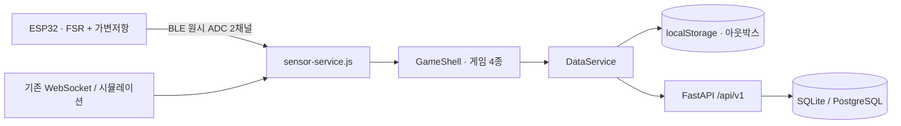

# ReGrip

**손 압력 센서로 4개의 게임을 조작하고, 훈련 결과와 보상을 기록하는 웹 프로토타입**

ReGrip은 ESP32의 FSR 압력값을 브라우저에서 처리해 풍선·크레인·리듬·잠수함 게임에 연결합니다. 센서 없이 시뮬레이션으로 체험할 수 있고, 서버 없이 로컬 기록을 사용할 수 있습니다. 로그인하면 같은 데이터 계층이 FastAPI와 동기화합니다.

이 문서는 **2026-09-05 코드 기준**입니다. 기존 제품 디자인을 유지하며, `design-review/`의 A/B/C HTML은 참고용 목업입니다.

## 현재 기능

- **입력 선택과 보정** — Windows Chrome/Edge의 Web Bluetooth로 ESP32에 연결합니다. FSR은 게임 조작, 가변저항의 flex 모사값은 진단 그래프에만 사용합니다. 기존 WebSocket과 명시적으로 선택하는 시뮬레이션도 지원합니다.
- **초보자 체험** — 난이도를 저장하지 않은 사용자는 쉬움으로 시작합니다. 각 게임에 최대 20초 연습이 있으며, 연습 결과는 세션·XP에 저장하지 않습니다.
- **중단과 재개** — 센서 수신 지연, 탭 숨김, 긴 프레임 공백 때 게임을 일시정지합니다. 연결이 돌아오면 사용자가 직접 재개합니다.
- **기록과 보상** — 본편 세션에 입력 출처와 BLE 보정 스냅샷을 저장합니다. 센서 측정 통계는 실제 센서 출처를 구분하고, XP·레벨·연속 훈련 보상은 모든 본편 세션을 기준으로 계산합니다.
- **로컬 보존과 동기화** — 세션을 localStorage에 보존하고, 서버 전송 전에 아웃박스에 등록합니다. 동일한 `clientSessionId`로 재전송해 중복 저장·보상을 막습니다. 캐시와 아웃박스는 계정·API별로 분리해 다른 사용자에게 업로드되지 않도록 합니다.
- **계정과 프로필** — 로그인, 프로필·아바타, 설정, 훈련 기록, 업적과 레벨 화면을 제공합니다.

## 구조



| 영역 | 현재 구현 |
|---|---|
| 프런트엔드 | 정적 HTML 13개, Vanilla JavaScript, Tailwind CDN |
| 게임 | DOM/SVG와 `requestAnimationFrame`; 센서 진단 그래프는 Canvas |
| 센서 | 별도 `sensor-service.js`와 연결 UI `sensor-ui.js`; BLE 우선, 기존 WebSocket 유지 |
| 데이터 | `shared.js`의 localStorage/REST 공통 `DataService` |
| 백엔드 | Python 3.11, FastAPI, SQLAlchemy, Pydantic |
| DB | SQLite 개발 환경, PostgreSQL용 SQL 마이그레이션 |
| 별도 연구 | NinaPro DB2 EMG 오프라인 분류 실험; 제품 입력과 미연결 |

세부 계약과 파일별 역할은 [ARCHITECTURE.md](ARCHITECTURE.md)에 정리했습니다.

## 로컬 실행

### 프런트엔드와 센서만 사용

저장소 루트에서 실행합니다.

```powershell
py -3.11 -m http.server 3000 --bind 127.0.0.1
```

Windows Chrome 또는 Edge에서 <http://localhost:3000>을 엽니다. 설정이나 게임 준비 화면에서 **센서 연결 → 보정**을 진행하거나 **시뮬레이션 사용**을 선택합니다. 시뮬레이션에서는 게임의 누르기 버튼 또는 `SPACE`를 사용합니다.

**실제 BLE 센서로 게임을 조작하는 데 백엔드는 필수가 아닙니다.** 프런트엔드 서버와 BLE 연결만으로 보정·게임·로컬 기록을 사용할 수 있습니다. 계정 로그인과 서버 기록 동기화에는 백엔드가 필요합니다. Web Bluetooth는 HTTPS 또는 localhost에서 사용하며, 펌웨어 업로드와 실제 연결 순서는 [센서 가이드](docs/SENSOR_GUIDE.md)를 따릅니다.

Tailwind와 일부 폰트는 CDN을 사용하므로, 인터넷을 완전히 차단한 상태의 최초 화면 로드까지 보장하는 구성은 아닙니다.

### 프런트엔드와 백엔드 함께 실행

먼저 [백엔드 설치 안내](backend/README.md)에 따라 가상환경과 의존성을 준비합니다. 기존 SQLite DB가 있으면 **DB를 삭제하지 말고** API를 중지한 뒤 업그레이드를 확인합니다.

```powershell
cd backend
.\venv\Scripts\python.exe -m scripts.upgrade_sqlite --database .\regrip_dev.db --dry-run
.\venv\Scripts\python.exe -m scripts.upgrade_sqlite --database .\regrip_dev.db
cd ..
```

이 명령은 기존 DB를 백업하고 누락된 세션 출처 컬럼만 추가합니다. 새 DB는 앱 시작 시 생성되므로, 아직 없는 파일에 업그레이드 명령을 실행할 필요가 없습니다.

```powershell
.\scripts\dev-start.ps1
# 브라우저를 자동으로 열지 않으려면:
.\scripts\dev-start.ps1 -NoBrowser
# 종료:
.\scripts\dev-stop.ps1
```

기본 주소는 프런트엔드 <http://localhost:3000>, API <http://localhost:8000>, API 문서 <http://localhost:8000/docs>입니다.

## 검증

```powershell
node --test tests/*.test.js
cd backend
.\venv\Scripts\python.exe -m pytest tests/ -q
```

최종 실행 결과와 검증 범위는 [VERIFICATION.md](docs/VERIFICATION.md)를 기준으로 확인합니다. 여기에는 JavaScript 런타임 테스트, API 테스트, 기존 SQLite DB 업그레이드와 재실행, 로컬 HTTP·헬스체크, BLE 펌웨어 빌드 결과를 구분해 기록합니다.

실제 ESP32 업로드·BLE 사용, 실제 브라우저 조작·화면 검수, PostgreSQL 실행은 이번 검증에 포함되지 않았습니다. 서버는 제출 결과로 별점·XP를 재계산하지만, 센서 입력의 진위 자체를 인증하지는 않습니다. 별도 EMG 연구 결과도 현재 게임의 센서 성능을 입증하지 않습니다.

## 문서

- [아키텍처와 현재 구현 경계](ARCHITECTURE.md)
- [센서 연결·보정·문제 해결](docs/SENSOR_GUIDE.md)
- [센서 데이터 정책과 과거 결정](docs/backend/04-sensor-data-policy.md)
- [백엔드 설치·API·DB 업그레이드](backend/README.md)
- [검증 기록](docs/VERIFICATION.md)
- [참고용 디자인 목업](design-review/DESIGN.md)

교육·연구 목적의 프로토타입입니다. 외부 사용 시 저장소와 연구 데이터의 라이선스를 각각 확인합니다.
