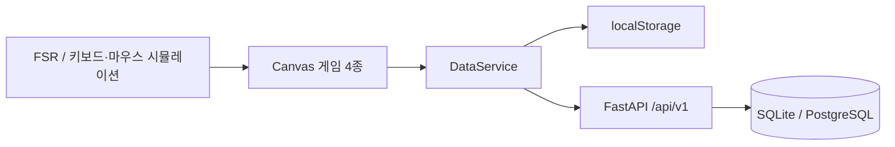

# ReGrip

**센서 입력을 4개의 재활 게임과 기록·보상 흐름으로 연결하는 오프라인 우선 손 재활 프로토타입**

ReGrip은 반복적인 손 재활 훈련을 Canvas 게임으로 바꾸고, 훈련 결과를 세션·XP·업적으로 기록합니다. 서버 없이도 전체 흐름을 실행할 수 있으며, 로그인 시 같은 화면이 FastAPI 백엔드로 전환됩니다.

> 현재 단계: 소프트웨어·시뮬레이션 검증 중. 저장소의 ESP32 WebSocket 경로는 아직 실기기에서 검증하지 않았고, 연결 UI도 남아 있습니다. 의료기기나 임상 성능을 주장하지 않습니다.

## What I Worked On

`2026.06–현재` · 3인 팀

- 앱 구조, 점수·세션 기록, 차트와 게이미피케이션 UI
- localStorage와 REST API를 교체할 수 있는 데이터 계층
- FastAPI API, 인증·세션 저장 경계, 테스트와 실행 문서
- ESP32 1채널 FSR 데이터 계약과 브라우저 시뮬레이션

## Product Flow



- **게임 4종** — 풍선, 크레인, 리듬, 잠수함
- **기록** — 세션, 세트 상세, 평균·최대 악력, 주간 통계
- **게이미피케이션** — 서버 권위 XP 원장, 레벨, 업적, streak
- **오프라인 우선** — localStorage 미러와 멱등 아웃박스로 실패 시 기록 보존
- **인증** — JWT access token과 회전·재사용 탐지를 둔 refresh cookie

## Architecture

| Layer | Current implementation |
|---|---|
| Frontend | 정적 HTML, Vanilla JavaScript, Tailwind CDN, Canvas 2D |
| Data | localStorage ↔ REST 교체형 `DataService` |
| Backend | Python 3.11, FastAPI, SQLAlchemy, Pydantic |
| Database | SQLite(dev) / PostgreSQL(prod 설계) |
| Sensor track | ESP32 + FSR, WebSocket `{force, timestamp}` 20Hz 계약 |
| Verification | pytest + httpx 기반 API 테스트, 시뮬레이션 입력 |

전체 시스템과 트랜잭션, 데이터 모델, 아직 연결하지 못한 부분은 [ARCHITECTURE.md](ARCHITECTURE.md)에 정리했습니다.

## Run Locally

### Frontend only

```bash
python -m http.server 3000
```

브라우저에서 <http://localhost:3000>을 열고 `SPACE` 또는 마우스 입력으로 센서를 시뮬레이션할 수 있습니다.

### Frontend + backend

```powershell
.\scripts\dev-start.ps1
```

```bash
./scripts/dev-start.sh
```

백엔드 환경 구성과 운영 경계는 [backend/README.md](backend/README.md)를 먼저 확인해 주세요.

### Backend tests

```bash
cd backend
python -m pytest
```

## Verified vs. Not Yet Verified

| Verified in this repository | Not yet verified |
|---|---|
| 4개 게임의 시뮬레이션 입력과 세션 저장 흐름 | 저장소 ESP32 펌웨어의 실제 하드웨어 연결 |
| localStorage/REST 전환, 미러, 멱등 아웃박스 | 앱 설정 화면에서 센서를 연결하는 사용자 흐름 |
| FastAPI 인증·프로필·세션·통계·보상 API | 공개 운영 배포와 실제 재활 사용자 사용성 |
| 백엔드 테스트와 아키텍처 문서 | 의료·임상 효과 |

별도 NinaPro DB2 EMG 분류 실험은 **오프라인 연구 트랙**입니다. 현행 1채널 FSR 제품 흐름과 연결되지 않았으며 제품 성능의 근거로 제시하지 않습니다.

## Documentation

- [Architecture](ARCHITECTURE.md)
- [Technology stack](docs/01-기술스택.md)
- [Sensor data policy](docs/backend/04-sensor-data-policy.md)
- [Backend guide](backend/README.md)

## License

교육·연구 목적의 프로토타입입니다. 외부 사용 전 저장소의 라이선스와 데이터 라이선스를 별도로 확인해 주세요.
