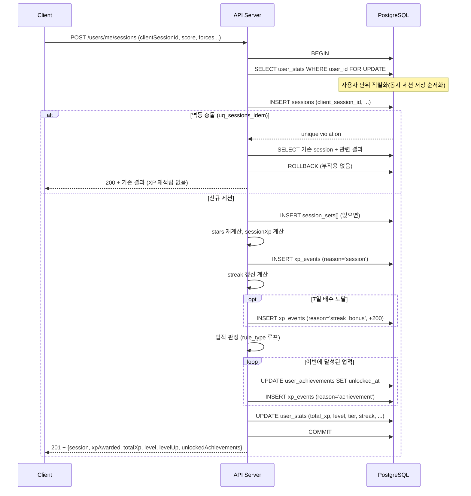

# 03. 게이미피케이션 엔진

> **한 줄 요약**: XP/레벨/티어/별점/업적을 전부 서버가 결정적으로 재계산한다(원칙 ①). 세션 저장은 유저 단위로 직렬화된 단일 트랜잭션에서 멱등하게 처리하고, 업적 판정은 동기로 수행해 응답에 동봉한다. FSR 측정치 위변조는 완전 차단 불가함을 정직하게 명시한다.

## 관련 문서
- 데이터 모델(`xp_events` 원장, `user_stats` 캐시): [01-erd.md](./01-erd.md)
- 세션 POST 계약과 응답 형태: [02-api-spec.md](./02-api-spec.md)
- 이상치/위변조 대응의 규모 판단: [05-scaling-roadmap.md](./05-scaling-roadmap.md)
- 설계 원칙 ①(서버 계산)·②(멱등성): [00-overview.md](./00-overview.md)

---

## 1. XP 규칙

프론트 UI 텍스트에서 확정된 규칙(세션당 50~150 XP, 업적당 100~500 XP, 7일 연속 200 XP)을 서버 공식으로 물화한다.

| 항목 | 공식 | 비고 |
|------|------|------|
| 세션 기본 XP | `base(50) + score × 2` | `score`는 게임 스코어(=`set_count`) |
| 세션 XP 상한 | `min(계산값, 150)` | cap 150 |
| 별 2개 보너스 | `+20` | 세션 XP에 가산 |
| 별 3개 보너스 | `+50` | 세션 XP에 가산 |
| 7일 연속 보너스 | `+200` | streak가 7의 배수 도달 시 1회 |
| 업적 XP | `reward_xp` (100~500) | 업적별 정의값 |

**예시**: score 10, 별 3개 → `50 + 10×2 = 70`, 여기에 별3 `+50` = `120 XP`. cap 150 이내.

```
sessionXp(score, stars):
  xp = 50 + score * 2
  if stars == 2: xp += 20
  if stars == 3: xp += 50
  return min(xp, 150)
```

> **결정(Decision)**: XP 규칙은 코드 상수/함수로 고정하고, DB에 넣지 않는다(업적의 `reward_xp`만 DB).
>
> **근거(Why)**: 세션 XP 공식은 게임 밸런스의 핵심이라 코드 리뷰·테스트 대상이어야 한다. 업적 보상값은 운영 튜닝 빈도가 높아 DB([01](./01-erd.md) 하이브리드 룰).
>
> **기각된 대안(Rejected)**: 모든 XP 규칙을 DB 설정으로 — 밸런스 변경이 리뷰·테스트를 우회, 사고 위험.

---

## 2. 레벨 공식

레벨은 1~100. 다음 레벨까지 필요 XP는 레벨이 오를수록 선형 증가한다.

```
xpToNext(level) = 100 + (level - 1) * 25      # level N → N+1 에 필요한 XP

# 누적: 레벨 L에 도달하기 위한 총 XP
cumulativeXp(L) = Σ_{k=1}^{L-1} xpToNext(k)
                = 100*(L-1) + 25 * (L-1)*(L-2)/2
```

**예시 누적 곡선**

| 레벨 | xpToNext | 누적 XP(도달 필요) |
|------|----------|--------------------|
| 1 | 100 | 0 |
| 2 | 125 | 100 |
| 5 | 200 | 550 |
| 10 | 325 | 2,125 |
| 20 | 575 | 8,150 |
| 50 | 1,325 | 60,025 |
| 100 | 2,575 | 366,175 |

`user_stats.level`은 이 공식으로 계산한 **유도값 캐시**다. 진실은 `total_xp`(= `SUM(xp_events)`)이며, `level`은 `total_xp`로부터 언제든 재계산된다.

---

## 3. 6티어 경계

프론트 `level.html`과 **동일 명칭**을 사용한다.

| 티어 코드 | 표시명 | 레벨 범위 |
|-----------|--------|-----------|
| `beginner` | 입문자 | 1 ~ 10 |
| `novice` | 초심자 | 11 ~ 20 |
| `apprentice` | 수련생 | 21 ~ 40 |
| `skilled` | 숙련자 | 41 ~ 60 |
| `expert` | 전문가 | 61 ~ 80 |
| `master` | 마스터 | 81 ~ 100 |

`tier`도 `level`에서 유도되는 캐시다.

---

## 4. 게임별 별점(stars) 재계산

프론트가 계산하던 별점을 서버가 재계산한다(원칙 ①). 게임별 임계값은 프론트 규칙과 동일하다.

| 게임(exercise_type) | ★3 | ★2 | ★1 |
|---------------------|-----|-----|-----|
| 풍선 (`game_balloon`) | `score >= 10` | `score >= 5` | 그 외 |
| 크레인 (`game_crane`) | `score >= 5` | `score >= 3` | 그 외 |
| 리듬 펌프 (`game_rhythm`) | `score >= 20` | `score >= 14` | 그 외 |
| 잠수함 (`game_glide`) | `score >= 24` | `score >= 15` | 그 외 |

임계값은 `services/labels.py` 의 `STAR_THRESHOLDS` 와 프론트 `GAME_DEFS.starThresholds` 에서 단일 진실로 관리한다(양쪽 값이 동일해야 별점이 일치).

```
stars(exerciseType, score):
  th = STAR_THRESHOLDS[exerciseType]   # (t2, t3)
  if th is None: return 1              # 비게임(pinch_hold 등)은 1로 처리
  t2, t3 = th
  return 3 if score>=t3 else 2 if score>=t2 else 1

# balloon (5,10) · crane (3,5) · rhythm (14,20) · glide (15,24)
```

> **결정(Decision)**: 별점은 서버가 `exercise_type` + `score`로 재계산해 `sessions.stars`에 저장한다. 클라가 보낸 stars는 무시.
>
> **근거(Why)**: 별점이 XP 보너스(별2 +20, 별3 +50)와 직결되므로 조작 유인이 있다(원칙 ①). 서버 재계산으로 일관성 확보.
>
> **기각된 대안(Rejected)**: 클라 stars 신뢰 — 보너스 XP 부풀리기 가능.

---

## 5. 업적 룰 카탈로그

`rule_type`별 판정 코드 + `rule_params` DB 파라미터([01](./01-erd.md) 하이브리드 룰).

| rule_type | 의미 | rule_params 예 | 판정 로직 |
|-----------|------|----------------|-----------|
| `session_count` | 누적 세션 수 도달 | `{"count": 10}` | `user_stats.total_sessions >= count` |
| `max_force_gte` | 최대 악력 임계 돌파 | `{"threshold": 60}` | `session.max_force >= threshold` (이번 세션 기준) |
| `streak_days` | 연속 훈련 일수 | `{"days": 7}` | `user_stats.current_streak >= days` |
| `total_sets` | 누적 세트 수 | `{"sets": 100}` | `Σ set_count >= sets` |

**정의 예시 (achievement_definitions 로우)**
```json
{ "id": "force_60", "title": "악력 60 돌파", "description": "최대 악력 60 이상 기록",
  "category": "grip_training", "rarity": "rare", "reward_xp": 200,
  "rule_type": "max_force_gte", "rule_params": {"threshold": 60},
  "is_active": true, "sort_order": 30 }
```

각 rule_type은 `progress`/`target`을 산출해 `user_achievements`에 반영하고, `progress >= target`이고 아직 `unlocked_at IS NULL`이면 **이번에 달성**으로 처리(→ `unlocked_at` 세팅 + 업적 XP 이벤트 적립).

### 5.1 정의된 업적 8종

`services/achievements.py` 의 `ACHIEVEMENT_SEEDS` 와 프론트 `GamificationEngine.ACHIEVEMENTS` 는 **동일한 id/타이틀/XP** 8종이다(4게임 체제 반영). `rule_params` 의 `exercise_type`/`min_sets`/`min_stars` 는 01 DDL 의 rule_type enum 을 확장하는 파라미터다.

| id | 타이틀 | 카테고리 | 희귀도 | XP | rule_type | rule_params |
|----|--------|----------|--------|----|-----------|-------------|
| `first_pop` | 첫 풍선 | game_play | common | 100 | session_count | `{count:1, exercise_type:game_balloon, min_sets:1}` |
| `first_capsule` | 첫 번째 캡슐 | game_play | common | 100 | session_count | `{count:1, exercise_type:game_crane, min_sets:1}` |
| `three_star` | 퍼펙트 훈련 | game_play | common | 150 | session_count | `{count:1, min_stars:3}` |
| `strong_grip` | 강철 악력 | grip_training | rare | 200 | max_force_gte | `{threshold:80, count:5}` |
| `consistency_king` | 꾸준함의 왕 | persistence | epic | 300 | streak_days | `{days:7}` |
| `halfway_goal` | 캡슐 수집가 | collection | legendary | 500 | total_sets | `{sets:500, exercise_type:game_crane}` |
| `first_rhythm` | 첫 박자 | game_play | common | 100 | session_count | `{count:1, exercise_type:game_rhythm, min_sets:1}` |
| `first_glide` | 첫 항해 | game_play | common | 100 | session_count | `{count:1, exercise_type:game_glide, min_sets:1}` |

---

## 6. 세션 저장 트랜잭션

세션 저장은 게이미피케이션 엔진의 심장이다. **유저 단위로 직렬화된 단일 트랜잭션**에서 멱등하게 처리한다.

### 6.1 시퀀스 (mermaid)



### 6.2 핵심 결정

> **결정(Decision) — user_stats를 FOR UPDATE로 잠가 유저 단위 직렬화**: 같은 유저의 세션 저장을 트랜잭션 시작 시 `SELECT ... FOR UPDATE`로 직렬화한다.
>
> **근거(Why)**: streak·total_xp·level은 순서 의존적이다. 동시 저장이 병렬로 읽고 쓰면 갱신 손실(lost update)이 난다. 유저 행 하나를 잠그면 그 유저의 세션 처리만 순서화되고, 다른 유저는 영향 없다(전역 락 아님).
>
> **기각된 대안(Rejected)**: 락 없이 낙관적 갱신 — streak/XP 경쟁 조건. 테이블 전역 락 — 불필요한 병목.

> **결정(Decision) — 멱등 충돌 시 XP 재적립 없이 기존 결과 200 반환**: `uq_sessions_idem` 위반이면 부작용(INSERT xp_events 등) 전에 롤백하고 기존 결과를 반환한다.
>
> **근거(Why)**: 원칙 ②(멱등성). 재전송이 XP를 이중 적립하면 안 된다. INSERT sessions가 트랜잭션 초반부라 충돌 시 아직 XP 이벤트를 만들지 않았으므로 안전하게 되돌린다.
>
> **기각된 대안(Rejected)**: 충돌 후에도 XP 계산 진행 — 이중 적립. 409 반환 — 정당한 재전송을 에러화([02](./02-api-spec.md)).

### 6.3 업적을 동기로 판정하는 이유

> **결정(Decision) — 업적 판정은 세션 트랜잭션 안에서 동기로**: 별도 워커/큐 없이 세션 저장 트랜잭션에서 업적을 판정하고 응답에 `unlockedAchievements`를 동봉한다.
>
> **근거(Why)**: (a) 업적이 ~20개, 룰이 카운터 수준이라 판정 비용이 극소다. (b) 세션 쓰기 TPS가 초당 1건 미만([00](./00-overview.md))이라 트랜잭션이 길어져도 처리량 문제가 없다. (c) 세션 종료 직후 업적 달성 연출을 하려면 응답에 즉시 담겨야 한다([02](./02-api-spec.md) §4.2).
>
> **기각된 대안(Rejected)**: 비동기 큐/워커로 분리 — 이 규모에 운영 복잡도만 추가, 연출 타이밍 어긋남.

### 6.4 분리 신호가 오면: outbox 전환 스케치 (부록)

동기 판정이 병목이 되는 신호(업적 룰이 무거워짐, 외부 알림/이메일 발송이 트랜잭션에 끼어듦, 쓰기 지연 증가)가 오면 **outbox 패턴**으로 부작용을 분리한다. Stage 2([05](./05-scaling-roadmap.md))에서 검토.

```sql
CREATE TABLE outbox_events (
  id           bigint GENERATED ALWAYS AS IDENTITY PRIMARY KEY,
  aggregate    text NOT NULL,          -- 'session' 등
  payload      jsonb NOT NULL,
  processed_at timestamptz,            -- NULL = 미처리
  created_at   timestamptz NOT NULL DEFAULT now()
);
```
세션 트랜잭션은 `outbox_events`에 이벤트를 같은 커밋으로 적재하고, 워커가 이후 알림·집계 등 부작용을 처리한다(트랜잭셔널 아웃박스). **지금은 하지 않는다.**

---

## 7. 타당성 검증 (422)

서버는 저장 전 도메인 검증을 수행한다. 위반은 422 `VALIDATION_FAILED`([02](./02-api-spec.md) 에러 규약).

| 검증 | 규칙 |
|------|------|
| 힘 범위·순서 | `0 <= avgForce <= maxForce <= 100` |
| 시간 정합성 | `durationSec > 0`, `startedAt`은 미래 금지(서버 시각 + 허용 스큐 초과 불가) |
| 세트-시간 모순 | `Σ hold_sec`가 `durationSec`를 크게 초과하면 거부(물리적 불가) |
| 일일 세션 상한 | 유저당 하루 최대 20세션. 초과 시 거부 |
| rate limit | 세션 POST에 유저별 rate limit 적용(429) |

이 중 힘 범위·순서·시간 양수는 [01](./01-erd.md)의 DB CHECK 제약으로 **이중 방어**한다.

> **결정(Decision) — 검증은 애플리케이션(422) + DB CHECK 이중화**: 도메인 규칙은 서버에서 422로 거르고, 물리적 불가값은 DB 제약으로도 막는다.
>
> **근거(Why)**: 애플리케이션 검증은 친절한 에러 메시지를, DB 제약은 코드 경로 우회/버그에도 무결성을 보장한다.
>
> **기각된 대안(Rejected)**: 한쪽만 — 메시지 품질(DB만) 또는 무결성(앱만) 중 하나 희생.

### 7.1 위변조에 대한 정직한 명시

**FSR 측정치 자체의 위변조는 완전 차단할 수 없다.** 클라이언트가 로컬에서 센서 값을 조작해 그럴듯한 `avgForce`/`maxForce`/`score`를 만들면, 서버는 그것이 실제 센서에서 왔는지 물리적으로 검증할 수 없다. 서버 재계산(원칙 ①)이 막는 것은 **별점·XP·업적 산출 로직의 조작**이지, **입력 측정치의 진위**가 아니다.

- 지금 하는 것: 물리적으로 불가능한 값(평균>최대, 미래 시각, 비현실적 세트/시간)과 남용 빈도(일일 상한, rate limit)를 거른다.
- **이상치 탐지(급격한 능력 점프, 통계적 이상 패턴)는 Stage 2**에서 도입([05](./05-scaling-roadmap.md)). 초기 규모에서는 비용 대비 효용이 낮고, B2C 재활 특성상 조작 유인도 제한적이다.
