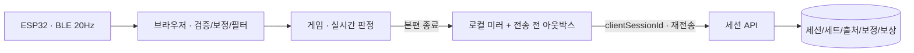

# 04. 센서 데이터 정책

**상태: 2026-09-05 구현 기준.** 실시간 센서 입력은 브라우저에서 처리하고, 서버에는 본편 세션 결과와 입력 출처·보정 스냅샷을 제출합니다. 현재 우선 경로는 **Windows Chrome/Edge의 ESP32 BLE**입니다. 기존 WebSocket은 호환 경로로 유지합니다.

이 문서는 과거 ADR의 전송 우선순위와 구현 범위를 갱신합니다. 현재 실행 구조는 [아키텍처](../../ARCHITECTURE.md), 실제 연결 절차는 [센서 가이드](../SENSOR_GUIDE.md), 검증 증거는 [VERIFICATION.md](../VERIFICATION.md)를 기준으로 합니다.

## 현재 결정: BLE 원시 2채널, FSR만 게임 조작

ESP32의 GPIO34는 FSR 압력, GPIO35는 가변저항의 flex 모사값입니다. 채널별 12비트 ADC를 50Hz로 측정하고 BLE notify로 최신 값을 20Hz 전송합니다.

```text
timestamp_ms,flex_raw,fsr_raw
12340,2010,970
```

게임 입력은 FSR만 사용합니다. 가변저항 값은 센서 입력 확인 그래프에 표시하며, 실제 flex 측정 또는 EMG 분류 결과로 해석하지 않습니다. 기기 이름·UUID·패킷 경계는 [센서 가이드](../SENSOR_GUIDE.md)에 명시합니다. USB 시리얼은 펌웨어 진단용이고 브라우저 Web Serial 경로는 없습니다.

`sensor-service.js`는 BLE 원시값의 형식·범위·타임스탬프를 검증합니다. 잘못된 값, 중복·역순 패킷은 버리고 uint32 타임스탬프 롤오버는 처리합니다. 유효 수신이 500ms 이상 없으면 `stale`입니다. 센서 모드에서 시뮬레이션으로 자동 전환하지 않습니다.

### 정규화와 보정의 범위

- BLE 보정은 이완·편안한 쥐기 각각 1초의 새 FSR 표본 중앙값을 사용합니다. 단계별 15개 이상, 수신 간격 150ms 이하를 요구합니다.
- 두 기준의 차이는 절댓값 64 ADC 이상, 각 단계 P95-P5 폭은 그 차이의 20% 이하여야 합니다. ADC가 증가하는 회로와 감소하는 회로를 모두 처리합니다.
- 개인 기준 대비 0~100%로 정규화한 뒤 시간 상수 80ms 지수 필터를 적용합니다. 원시 ADC는 진단 그래프에 따로 표시합니다.
- 브라우저 사용자·기기별로 보정을 저장하고 이전 논리값 보정을 BLE ADC에 재사용하지 않습니다. 보정 저장 실패는 준비 완료로 처리하지 않습니다.
- 캡처 도중 사용자·기기·연결이 바뀌거나 수신이 중단되면 취소합니다. BLE 본편 시작에는 최신 수신과 유효한 현재 보정이 모두 필요합니다.

브라우저의 BLE 기기 ID는 로컬 보정 범위를 구분하는 값입니다. 서버의 `devices.id` UUID와 동일하지 않습니다. 서버 기기 등록 API는 아직 구현하지 않았으므로 브라우저 ID를 해당 필드에 대입하지 않습니다.

## 현재 결정: 로컬 게임, 본편 결과 동기화



게임 조작에 백엔드 연결은 필요하지 않습니다. 사용자가 선택한 시뮬레이션도 같은 게임을 조작합니다. 최대 20초 연습은 저장·XP 지급 대상이 아니며, 본편 시작 때 상태를 초기화합니다.

본편의 `inputSource`와 BLE 보정 스냅샷은 시작 시 복사해 고정합니다. 입력 모드나 보정이 바뀐 상태를 한 세션에 혼합하지 않습니다. 센서 중단·탭 숨김·사용자 일시정지 시간은 제외하고, 250ms를 넘는 프레임 공백은 일시정지로 처리합니다. 연결 회복만으로 자동 재개하지 않습니다. 정상 프레임은 실제 경과 시간을 판정과 기록에 동일하게 반영합니다.

DataService는 로컬 세션 미러를 저장한 뒤, 네트워크 요청 전에 API 페이로드를 아웃박스에 기록합니다. 전송 실패는 재전송할 수 있게 남기고 성공하면 같은 ID 항목을 제거합니다. 서버의 `(user_id, client_session_id)` 유일성으로 재전송을 멱등 처리합니다.

## 현재 결정: 출처와 보상 계산을 구분

`inputSource`는 `ble`, `websocket`, `simulation`, `unknown` 중 하나입니다. BLE 세션에는 다음 보정 스냅샷이 필수이며, 다른 출처에는 제출하지 않습니다.

```json
{
  "version": 2,
  "source": "ble",
  "unit": "adc_12bit",
  "channel": "fsr",
  "baseline0": 700,
  "baseline100": 2100,
  "capturedAt": "2026-09-05T12:00:00Z"
}
```

서버는 스냅샷의 버전·출처·단위·채널, 유한한 0~4095 기준값, 64 ADC 이상 차이, 시간대가 포함된 측정 시각을 검증합니다. 게임별 요약 힘 비율은 유한한 0~100 값이어야 합니다.

기록 목록·측정 통계는 `all`, `real`, `simulation`, `unknown`으로 필터링합니다. `real`은 `ble`와 `websocket`을 뜻합니다. 홈의 센서 측정 요약은 실제 센서 출처를 사용합니다. XP·레벨·연속 훈련은 모든 본편 기록을 기준으로 계산하며, 시뮬레이션을 측정 통계에서 분리해도 보상을 삭제하지 않습니다.

기존 세션은 `unknown`으로 유지합니다. 이전 점수·XP를 지우거나 실제 센서 기록으로 추정하지 않습니다. PostgreSQL 004 마이그레이션과 기존 SQLite 백업·업그레이드 절차는 [백엔드 가이드](../../backend/README.md)에 있습니다.

서버가 별점·XP를 재계산하는 것은 **보상 규칙의 일관성**을 보장하는 경계입니다. 제출한 압력·점수가 물리 센서에서 발생했는지 증명하는 기능은 아닙니다. 출처 태그 역시 클라이언트 입력 경로의 기록이며 기기 서명·하드웨어 인증을 의미하지 않습니다.

## 과거 ADR과 계획의 상태

| 이전 결정 | 현재 상태 |
|---|---|
| ADR-04-0: Wi-Fi WebSocket 우선 | **대체됨.** 현재 사용자 대상은 Windows Chrome/Edge이며 BLE 우선. 기존 `{force, timestamp}` WebSocket 경로는 유지 |
| ADR-04-1: 실시간 입력은 로컬 처리, 서버에 세션 요약 제출 | **유지.** 본편 출처·보정 스냅샷과 전송 전 아웃박스 보존을 추가 |
| ADR-04-2: `force_series`를 1Hz로 저장 | **부분 설계.** API·모델에 필드가 있으나 현재 게임 프런트엔드는 1Hz 시계열을 생성·제출하지 않음 |
| ADR-04-3: 원시 파형을 세션 종료 후 배치 업로드 | **미구현 계획.** 실제 요구 확정 후 검토할 Stage 3 과제 |

현재 서버는 BLE 20Hz 원시 ADC 스트림을 수신·보관하지 않습니다. `POST .../sessions/{id}/raw-samples`, S3/TimescaleDB, 실시간 스트리밍 인프라는 구현된 API나 운영 환경이 아닙니다. [확장 로드맵](05-scaling-roadmap.md)의 해당 항목은 미래 계획입니다.

NinaPro DB2 EMG 분류는 별도의 오프라인 연구 트랙입니다. 현재 FSR 게임 입력과 가변저항 진단값을 해당 모델에 연결하지 않았습니다. 연구 성능 수치를 현재 센서·게임 성능으로 사용하지 않습니다.