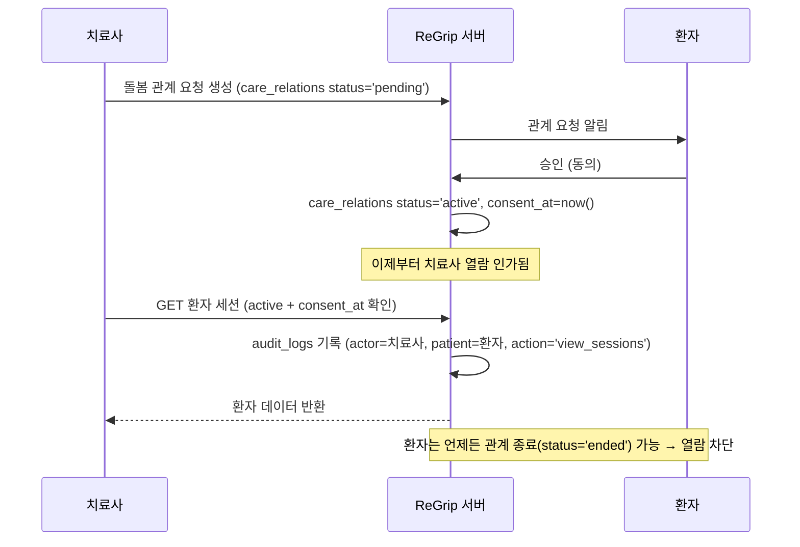

# 07. B2B 확장 (병원 / 치료사)

> **한 줄 요약**: 병원·재활센터 치료사가 담당 환자의 훈련 데이터를 모니터링하고 처방을 내리는 B2B 확장. 스키마(`organizations`/`org_members`/`care_relations`/`prescriptions`)는 지금 선반영하되 기능은 Stage 3에서 켠다. 열람은 **환자 동의(`consent_at`) + 활성 관계**를 전제로만 허용한다.

## 관련 문서
- 테이블 DDL: [01-erd.md](./01-erd.md) §5
- B2B 엔드포인트·인가: [02-api-spec.md](./02-api-spec.md) §6
- 열람 인가·동의·감사 로그: [06-security-compliance.md](./06-security-compliance.md) §5
- 확장 시점(Stage 3): [05-scaling-roadmap.md](./05-scaling-roadmap.md)

---

## 1. 왜 지금 스키마만 선반영하는가

> **결정(Decision)**: B2B 테이블은 지금 스키마에 포함하되(01), **기능(엔드포인트·대시보드)은 Stage 3에서** 활성화한다.
>
> **근거(Why)**: B2C가 우선이고 B2B 요구는 아직 계약으로 확정되지 않았다. 그러나 `care_relations`·`prescriptions`의 존재는 코어 데이터 모델(특히 `sessions`·동의·감사)의 형태에 영향을 준다. 나중에 붙이면 마이그레이션이 커지므로 **테이블 뼈대만 미리** 두어 코어 설계를 B2B와 정합하게 맞춘다. 기능 코드는 요구 확정 전 만들지 않는다(과설계 금지, [05](./05-scaling-roadmap.md)).
>
> **기각된 대안(Rejected)**: B2B를 완전히 나중에 설계 — 코어 스키마 재작업(동의/감사/관계) 유발. 지금 기능까지 구현 — 요구 미확정 기능에 개발·유지 비용.

---

## 2. 데이터 모델 (역할별 설명)

DDL은 [01-erd.md](./01-erd.md) §5에 있다. 여기서는 각 테이블의 역할과 관계를 설명한다.

### 2.1 organizations — 시설

병원/재활센터/클리닉 등 B2B 계약 주체. `type`(hospital/rehab_center/clinic/other), `biz_reg_no`(사업자등록번호).

### 2.2 org_members — 시설 구성원

시설에 속한 유저와 그 역할. `role`은 `therapist`(치료사) 또는 `org_admin`(시설 관리자). PK는 `(org_id, user_id)` 복합 — 한 유저가 여러 시설에 속할 수 있고, 한 시설에 여러 구성원이 있다.

### 2.3 care_relations — 치료사-환자 돌봄 관계 (핵심)

치료사와 환자를 잇는 관계. **동의와 인가의 중심**이다.

| 컬럼 | 역할 |
|------|------|
| `therapist_user_id` | 담당 치료사 |
| `patient_user_id` | 대상 환자 |
| `org_id` | 소속 시설(맥락) |
| `status` | `pending`(요청됨) → `active`(활성) → `ended`(종료) |
| `consent_at` | **환자 동의 시각. NULL이면 어떤 열람도 불가** |
| `started_at` / `ended_at` | 관계 기간 |

> **결정(Decision)**: 환자 데이터 열람은 `status='active'` **그리고** `consent_at IS NOT NULL`을 동시에 만족할 때만. 위반 시 403 + 전건 감사([06](./06-security-compliance.md) §5).
>
> **근거(Why)**: 관계가 있다는 사실과 환자가 동의했다는 사실은 다르다. 둘을 분리된 조건으로 강제해야 동의 없는 열람을 구조적으로 막는다. `pending` 상태(요청됐으나 미동의)에서 열람이 새지 않게 한다.
>
> **기각된 대안(Rejected)**: `status`만으로 인가 — 동의 없는 활성화 시 열람 누출. 동의를 별도 테이블로 분리 — 인가 쿼리 복잡도 증가, 같은 관계에 1:1이므로 컬럼이 적절.

### 2.4 prescriptions — 처방

치료사가 `care_relation`에 대해 내리는 훈련 처방. `exercise_type`, `target_force`, `sets`, `reps`, `days_per_week`, `valid_from`/`valid_to`, `note`.

> 의료법상 "처방"은 훈련 가이드(훈련 보조)로서의 성격이며 의료 처방을 표방하지 않는다([06](./06-security-compliance.md) §1.2). UI 문구도 "훈련 계획/권장"으로 다룬다.

---

## 3. 동의 플로우

환자 동의가 열람의 전제다. 플로우:

- 환자가 **거부**하면 관계는 `pending`에 머물러 열람 불가.
- 환자가 **종료**하면 `status='ended'` → 열람 즉시 차단.
- 모든 열람은 성공·실패 관계없이 `audit_logs`에 남는다([06](./06-security-compliance.md) §5.2).

---

## 4. 치료사 대시보드 요구사항 초안

Stage 3에서 구현할 대시보드의 초기 요구사항이다(상세 UX는 별도 설계).

| 화면/기능 | 데이터 소스 | 인가 |
|-----------|-------------|------|
| **담당 환자 목록** | `care_relations`(active + consent) + 환자 기본 프로필 | 동의된 관계만 노출 |
| **환자별 세션 추이** | 환자 `sessions`(기간별 avg/max force, stars, streak) | 관계별 인가 + 감사 |
| **처방 대비 이행률** | `prescriptions` vs 실제 `sessions`(처방 대비 실제 훈련 일수/강도 비교) | 관계별 인가 + 감사 |

- **담당 환자 목록**: `GET /orgs/{orgId}/patients`([02](./02-api-spec.md) §6). 동의되지 않은 관계는 목록에서 제외.
- **환자별 세션 추이**: `GET /orgs/{orgId}/patients/{userId}/sessions`. 기간 필터·차트용 집계(Stage 2의 `daily_user_stats` 활용, [05](./05-scaling-roadmap.md)).
- **이행률**: 처방(`days_per_week`, `target_force`, `sets`/`reps`)과 실제 세션을 대조. 예: "주 5일 처방 대비 이번 주 3일 수행(60%)".

---

## 5. 요금 / 계약 모델

**TBD (미정)**. B2B 요금·계약 구조(시설 단위 구독, 환자 수 기반 과금, 치료사 시트 라이선스 등)는 사업 요구가 구체화되면 확정한다. 이 문서 범위 밖이며, 스키마상 `organizations`가 계약 주체 앵커가 될 것이다.

---

## 6. B2B 확장 시 코어에 미치는 영향 요약

- **인가 계층**: 기존 "내 데이터만"에서 "동의된 관계 경유 타인 데이터"로 확장. `care_relations` 검사 미들웨어 필요.
- **감사**: 타인 데이터 접근은 전건 `audit_logs` 대상([06](./06-security-compliance.md)).
- **집계**: 대시보드 집계 부하는 읽기 복제본 + `daily_user_stats`로 흡수(Stage 2, [05](./05-scaling-roadmap.md)).
- **데이터 방향**: 병원 데이터 수신 없음. 자사 측정 데이터의 **단방향 제공만**([06](./06-security-compliance.md) §1.2).
