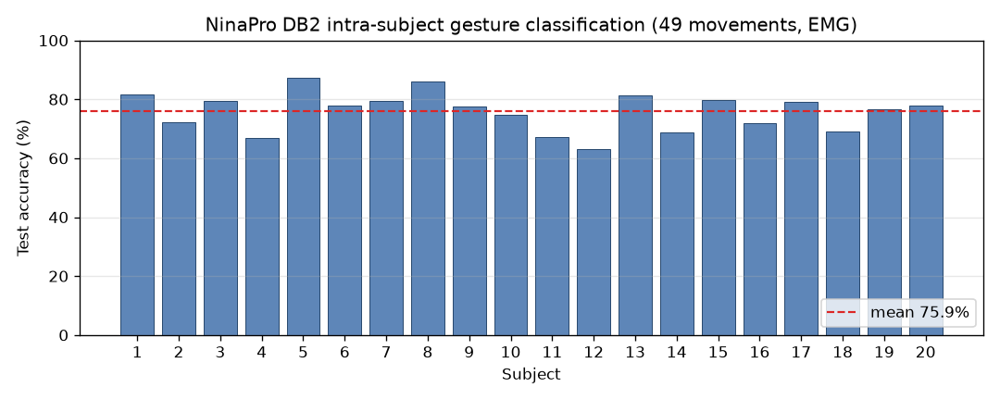
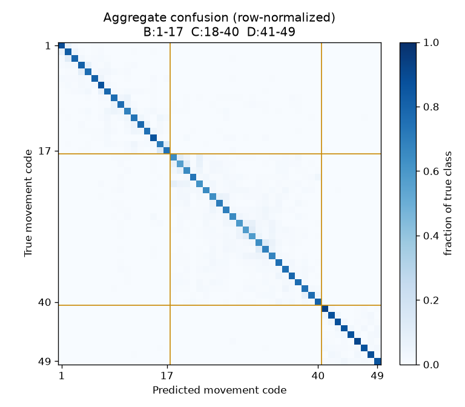

# 09 · ML 학습 — NinaPro DB2 20명 인제스트 + EMG 제스처 분류

> 08(신호 카탈로그)에서 만든 sig_* 카탈로그에 **실제 NinaPro DB2 20명**을 인제스트하고,
> 그 위에서 **EMG 기반 손동작 분류 모델**을 학습·평가한 기록. 데이터 구조·인제스트 절차·학습 방법·
> 결과·재현 방법을 담는다. 2026-07-23 수행.

---

## 0. 요약

- **데이터**: NinaPro DB2 subject 1~20 (각 3파일 E1/E2/E3), 총 60개 기록을 카탈로그에 인제스트.
- **모델**: 12채널 EMG 시간영역 특징 → RandomForest로 **49개 손동작 분류**(피험자별).
- **결과**: 테스트 정확도 **평균 75.9% ± 6.4%** (피험자 범위 63.2~87.3%). NinaPro DB2 문헌 수준과 일치.
- **중요 한계**: 이 모델은 **12채널 EMG**를 입력으로 쓴다. ReGrip 기기는 **FSR 악력 1채널**뿐이라
  이 모델을 기기에 그대로 올릴 수 없다(§5). 지금 단계의 가치는 "카탈로그가 실제 ML까지 도는 것을
  end-to-end로 검증"하고 **재현 가능한 기준선**을 세운 것이다.

---

## 1. 데이터 구조

### 1.1 원본 (NinaPro DB2)
피험자 1명당 `.mat` 3개 = 운동 프로토콜 3블록:

| 파일 | exercise | 블록 | 동작 | 포함 신호 |
|---|---|---|---|---|
| `S{n}_E1_A1.mat` | 1 | **B** | 기본 손가락/손목 17종 | EMG·ACC·**glove**·inclin |
| `S{n}_E2_A1.mat` | 2 | **C** | 기능적 파지 23종 | EMG·ACC·**glove**·inclin |
| `S{n}_E3_A1.mat` | 3 | **D** | 힘 패턴 9종 | EMG·ACC·**force**·forcecal·activation |

- **EMG**: 12채널 @2000Hz (Delsys Trigno). 이번 학습의 입력.
- **ACC**: 36채널(12센서×3축) @실질 148Hz. **glove**: 22채널 CyberGlove(무단위 ADC) @25Hz(E1/E2만).
- **force**: 6채널 손가락 힘 @100Hz(E3만) + `forcecal`(2×6 보정행렬).
- **restimulus**: 동작 라벨(전역 코드 0=rest, 1~17=B, 18~40=C, 41~49=D). **rerepetition**: 반복 회차(1~6).

### 1.2 카탈로그 (sig_* 7테이블) — 이번 인제스트 결과

```
sig_dataset(1)        ninapro_db2, license=citation-only, redistributable=false
└ sig_subject(20)     s1~s20
  └ sig_recording(60) 피험자×블록 (B:20 C:20 D:20)
    ├ sig_signal_blob(180)  기록×모달리티 (emg:60 acc:60 glove:40 force:20)
    │ └ sig_channel(3880)   채널 메타(이름·단위·gain/offset)
    └ sig_segment(11820)    구간 라벨 (움직임 5880 = 20×49×6, rest 5940)
```

- **원시 신호는 DB에 없다.** 각 blob은 content-addressed `.npy` 파일(`rel_path`=`blobs/sha256/xx/yy/<64hex>.npy`,
  `sha256`로 무결성 보장)로 저장되고 DB엔 메타(샘플수·채널수·레이트·경로·해시)만 있다.
  총 blob 파일 **180개, 5.82GB** (gitignore된 `backend/storage/sig-blobs/`, 커밋 안 됨).
- **레이트 이원화**: `native_rate_hz`(실제 정보 레이트, 예 acc 148)와 `stored_rate_hz`(원본 .mat 저장 레이트 2000).
  EMG는 native=stored=2000이라 segment 샘플 인덱스가 EMG blob과 **1:1 정렬**된다(학습이 이 성질을 씀).
- **움직임 세그먼트 5,880 = 20명 × 49동작 × 6반복** 정확히 일치 → 라벨 정합성 확인됨.

---

## 2. 인제스트 절차

### 2.1 파이프라인
`.mat` → **mat_loader**(키 검증·probe) → **preproc**(`resample_poly`로 네이티브 레이트로 다운샘플, EMG는 그대로)
→ **blobstore**(float32 `.npy` 직렬화 → sha256 → content-addressed 저장) → **segments**(restimulus run-length →
`[start,end)` 구간, 전역 코드로 라벨). 오케스트레이터 `scripts/sig/ingest_db2.py`.

### 2.2 실데이터에서 드러나 바로잡은 것 (합성 데이터로는 못 잡던 것)
20명을 넣기 전 s1으로 probe해 파이프라인 가정 오류 5건을 수정했다(상세 08 §3.2, 커밋 `470bc73`):
- **미지 키**: 실파일의 `inclin`(E1/E2)·`activation`(E3)을 허용(학습에 불필요해 blob엔 안 넣음).
- **라벨 오프셋 제거**: restimulus가 **이미 전역 코드**(C=18~40, D=41~49)라 오프셋을 더하면 오라벨.
  값을 그대로 쓰되 블록별 허용범위를 검증(C 18→18, D 41→41).
- **glove 옵션화**: E3엔 glove 없이 force → 존재하는 모달리티로만 blob 구성.
- **길이 정렬**: 신호와 라벨 길이가 경계 트림으로 조금 어긋남(실측 s1_E3=1, s12_E3=272 샘플) →
  공통 최소 길이로 정렬. 허용치는 **신호 길이의 1%**(고정 256은 s12의 272를 잘못 막아 상대치로 교체).
- **forcecal 방향 검증**(row0=min<row1=max).

### 2.3 결과·재현
- 60개 중 **60개 전부 성공**(임계값 수정 후). 20명 배치 인제스트 약 3분.
- 재현: `python scripts/sig/ingest_batch.py --download-root ~/Downloads --subjects 1-20 --fresh`
  (blob·DB는 `backend/storage/`에 생성, gitignore). 원본 `.mat`은 저작권상 저장소에 넣지 않는다
  (ninapro.hevs.ch 등록 후 각자 내려받음).

---

## 3. 학습 방법

**과제**: EMG 12채널으로 **어떤 손동작인지** 분류(49동작, rest 제외). NinaPro의 표준 벤치마크.

**방식** (`scripts/ml/train_gesture.py`):
1. **윈도잉**: 각 라벨 구간(동작 1회 반복) 안에서 EMG를 **200ms 창(400샘플)·100ms 보폭(200샘플)**으로 슬라이딩.
   창 하나 = 표본 1개, 라벨 = 그 구간의 동작 코드. EMG는 2000Hz 1:1 정렬이라 segment 인덱스를 그대로 슬라이스.
2. **특징**(채널당 5종, 표준 sEMG 시간영역 = 5×12ch = **60차원**):
   MAV(평균절대값)·RMS·WL(파형길이)·ZC(영교차)·SSC(기울기부호변화).
3. **분할**(Atzori DB2 공식 프로토콜): 6반복 중 **train {1,3,4,6} / test {2,5}**. 같은 동작의 다른 반복으로
   나눠 "본 적 없는 반복"에서 평가 → 낙관 편향 없음.
4. **모델**: RandomForest(150 trees). 스케일링 불필요, sEMG 분류의 표준 기준선.
5. **피험자별(intra-subject)**: EMG는 개인차가 커 피험자 간 일반화가 어렵다. 20명 각각 학습·평가 후 평균 —
   NinaPro의 표준 보고 방식.

의존성: `requirements-ml.txt`(scikit-learn, matplotlib). numpy/scipy/sklearn은 `scripts/`·학습에만 쓰고
운영 API(`src/`)는 여전히 stdlib-only(08의 격리 규칙 유지).

---

## 4. 결과

**피험자 20명 평균 테스트 정확도 75.93% ± 6.35%** (균형정확도 76.61% ± 5.66%),
피험자 범위 **63.2%(s12) ~ 87.3%(s5)**. 전체 테스트 창 통합(micro) 75.41%. 학습·평가 총 45초.



**블록별 정확도**: B(기본 손가락, 17종) **79.1%** · C(기능적 파지, 23종) **68.4%** · D(힘, 9종) **88.6%**.
C가 가장 어렵다 — 파지 동작이 많고(23종) 서로 유사(주먹·구형·원통형 등)해 혼동이 크다.
D가 가장 쉽다 — 동작이 9종으로 적고 힘 패턴이 뚜렷하다.



혼동행렬(행 정규화)에서 오분류가 **블록 대각 블록 내부**에 몰려 있다(같은 블록의 유사 동작끼리 헷갈림).
블록 간(B↔C↔D) 혼동은 적다 — 손가락/파지/힘은 EMG 패턴이 충분히 구분된다.

이 수치는 문헌(Atzori et al. 2014, DB2에서 고전 특징+분류기 ~75%)과 일치한다 —
파이프라인이 올바르게 동작함을 뒷받침한다.

---

## 5. ReGrip 적용 관점 (중요)

**이 모델은 ReGrip 기기에 그대로 올라가지 않는다.** 입력이 12채널 EMG인데 ReGrip은 FSR 악력 1채널뿐이다.
이 단계의 실질적 가치는 셋이다:

1. **카탈로그가 실제 ML까지 end-to-end로 돈다는 검증** — 인제스트→blob→segment→특징→학습→평가가 실데이터로 성립.
2. **재현 가능한 기준선** — 방법론(윈도잉·특징·반복분할·평가)이 확립됐다. ReGrip 자체 데이터가 쌓이면 그대로 재사용.
3. **부분적으로 관련 있는 신호** — E3의 **force 채널**은 악력에 가장 가깝고, glove(관절각 프록시)도 참고 가능.

**기기 적용으로 가는 현실적 경로**:
- **ReGrip FSR 데이터 수집** — 기기로 실제 사용자 악력 시계열 + 동작 라벨을 모아 같은 카탈로그(`modality='fsr'`)에 인제스트.
  스키마는 이미 FSR 슬롯을 갖고 있다(08). 이게 진짜 학습 데이터다.
- **전이(transfer)** — NinaPro로 사전학습한 표현을 FSR로 미세조정, 또는 force 채널만으로 악력-동작 관계를 학습해 프록시로.
- **과제 재정의** — ReGrip에 실제로 필요한 건 "49동작 분류"가 아니라 "악력 세기 추정·목표 유지 판정"일 수 있다.
  그렇다면 force 회귀가 더 적합하다(이번 분류는 파이프라인 실증용).

---

## 6. 재현 방법

```bash
cd backend
./venv/Scripts/python.exe -m pip install -r requirements-ingest.txt -r requirements-ml.txt

# 1) 20명 인제스트 (원본 .mat 은 ~/Downloads/DB2_s{1..20}/ 에 압축해제돼 있어야 함)
./venv/Scripts/python.exe scripts/sig/ingest_batch.py --subjects 1-20 --fresh

# 2) 제스처 분류 학습·평가
./venv/Scripts/python.exe scripts/ml/train_gesture.py --win 400 --step 200
#    → backend/storage/train_results.json (피험자별 + 요약)
```

- blob·DB·결과 JSON·예측은 전부 `backend/storage/`(gitignore) → 저장소에 안 들어간다.
- 원본 데이터셋은 라이선스상 재배포하지 않는다(citation-only). 각자 ninapro.hevs.ch에서 내려받는다.
- 그림(`assets/ml_accuracy.png`, `ml_confusion.png`)은 학습 산출물로 문서와 함께 커밋한다.

## 7. 다음 단계
- **force 회귀** — E3 force로 악력 추정 모델(ReGrip에 더 직접적). 
- **ReGrip FSR 데이터 파이프라인** — 기기→WebSocket→카탈로그(`modality='fsr'`) 수집 경로.
- **DB9(관절각)** — `s_1_angles.zip` 보유. 손가락 각도까지 추정할 경우에만 필요(선택).
- **인제스트 재개 자동화** — 실패 파일 재시도, 진행 상황 로깅.
